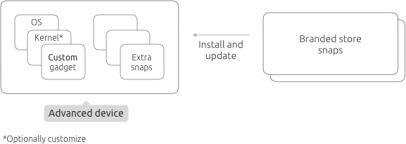

# Advanced Production Model

The advanced production model supports a wide range of options and provides a rich set of cusomtize device, upgrade, and store functionality. 

Highlights:

* You define your own device type (your _model_):
    * A standard or customized kernel snap [link to kernel snap creation]
    * A customized gadget snap [link to reference/gadget.md] (required with a branded store)
    * A factory image with extra snaps (which may not be publicly available)
* Your our own _branded store_ of snaps your devices connect to
* Additional features, such as _Update Control_ to manage when updates are published to your devices in the field

The advanced go-to-production model involves a bit more up-front work than the simple model. But the end result is a highly manageable and customizable experience for your customers and your device ecosystem.

This diagram summarizes the in-field advanced model:

## Steps

While the advanced model is highly flexible, the overall steps needed are straightforward:

1. Create your branded store and get technical assistance through Canonical
1. Determine your device and kernel
1. Create and publish your gadget snap in your store
1. Create and publish the extra snaps needed for your device's compelling functionality in your store
1. Create a _model assertion_, and sign it using a registered key
1. Create your device image (including your extra snaps) using the _signed model assertion_
1. Flash your image to your devices at your production facility / factory
1. Perform an initial boot of the device in the factory to get a _signed serial assertion_ from a _Serial Vault_
1. Distribute your devices to the consumer

Let's take a closer look at some these steps.

## Create your branded store

A branded store is set up by Canonical for you. So, you need to contact your Canonical representative first. 

Canonical provides a _brand account_ and a _branded store_ connected to this account.

Canonical also provides instructions, tools and processes needed for manufacturing, including, for example, creating the serial vault.

## Determine your device and kernel

You can select from numerous already supported device types and use the appropriate standard Canonical kernels.

You can also deploy a new device and use a customize kernel to support it. When customizing the kernel, you also need to publish it to your store.

For info on bringing up new device types, see TODO: add link to bring up a board and kernel docs.

## Create your gadget snap

As noted, a customized gadget snap is required when you have a branded store. 

Notably, the gadget snap's prepare-device hook needs to be customized. It provides the URL the device uses in the factory to connect to the serial vault. It also provides the device serial number. In the factory, the device contacts the serial vault, which returns a signed _serial assertion_, which guarantees the device identity, needed when accessing the branded store.

For information on the gadget snap, see [Gadget Snap Format](../../reference/gadget.html)

## Create your extra snaps

Naturally, your device provides a compelling user experience based at least in part on your unique software. You package this software as snap packages and publish them in your branded store. This software is available only to devices whose model assertion specifies your brand and store.

Detailed information about building snap packages can be found on [snapcraft.io](http://snapcraft.io).

## Create the model assertions

Building your device image requires a signed a _model assertion_. The model assertion is a complete statement of what the device is, including its brand, its store, its CPU architecture, the snaps it is constructed from, and more. You sign it with a key you have registered with the Ubuntu Store, and the signed model assertion is included in the device image. On boot, Ubuntu Core authenticates the signed model assertion with the Ubuntu Store, thus ensuring the authenticity of the device model. (Failed authentication prevents the device from booting to completion.)

Steps for creating a signed model assertion are provided here <http://docs.ubuntu.com/core/en/guides/build-device/image-building>.

Here is a sample of JSON file used as input when creating a model assertion for a fictional device, the "Device 1", made by the brand "ACME Corp". The host architecture is armhf. The image is populated with the gadget and kernel snaps that support this hardware, the core snap, and two extra snaps required for the device to function correctly, "acme-dashboard" and "acme-control-plane". 

**Note** The `authority-id` and `brand-id` must match the account-id defined for the ACME Corp account.

    {
      "type": "model",
      "authority-id": "acme",
      "brand-id": "acme",
      "store": "abcdef123456789"
      "series": "16",
      "model": "acme-device-1",
      "architecture": "armhf",
      "gadget": "device-1",
      "kernel": "device-1-kernel",
      "required-snaps": ["acme-dashboard", "acme-control-plane"],
      "timestamp": "2016-12-01T12:00:00+00:00"
    }

One you have the signed model assertion, your kernel, gadget and extra snaps, you can build your image.

## Build the image

You build your image with the `ubuntu-image` tool, provided as a snap on Ubuntu and other distributions. 

For steps to create an image from the signed model assertion, see: <http://docs.ubuntu.com/core/en/guides/build-device/image-building>.

The result is an image file that you take to your factory to flash onto your devices.

## Factory: flash you devices

Naturally, in the factory you flash your image onto your devices. The exact method here varies from case to case.

## Factory: boot with serial vaule
 
After the device is flashed, it is booted once in the factory.

As noted, the advanced model requires that every device obtains a serial assertion signed by your branded account. This step occurs during this first boot in the factory. The device contacts the serial vault (using the URL specified in the gadget snap). For security reasons, the serial vault is generally inside the factory. The device provides other information as well, crucially, its serial number (which is also provided by the gadget snap). The serial vault returns the signed serial assertion to the device, and the device may then power down. When running in the field, this signed serial assertion is authenticated by the store and is required to access branded resources.

To support you in managing you keys and signing the serial assertion during the production process Canonical have developed an open source tool called the [Serial Vault](http://github.com/ubuntu-core/identity-vault).

The serial vault ensures your devices leave production ready to communicate with the branded store and gives you confidence that only devices produced by you have access to your snaps.

## Distribute your devices

When your devices are in the field and operational they will communicate with your branded store to identify when updates are available or to install snaps that the user wants.

